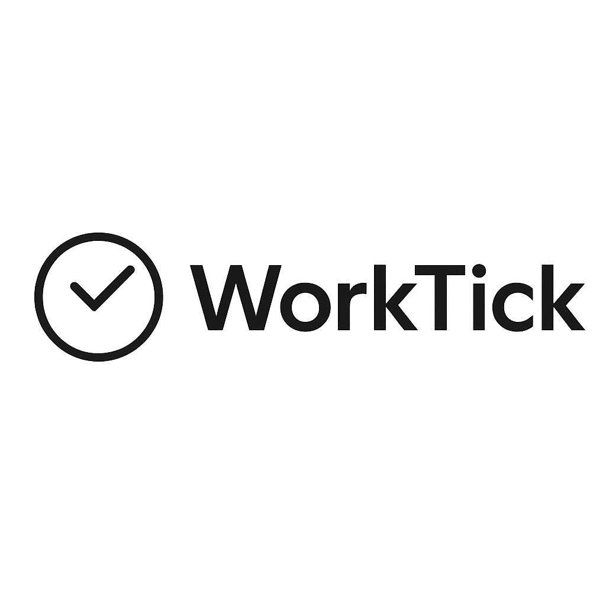

# WorkTick

> Time tracking system for teams built with **Flutter 3.22+** and **Firebase** (Auth + Firestore).  
> Material 3 UI, clean architecture, PL/EN localization, admin/user roles, list & calendar views, monthly reports with CSV export.

<p align="center">
  
</p>

---

## Features

- **Auth**: Email/password (Firebase Auth)
- **Profiles & Presence**: Start/Stop with note & work type (office/remote/field)
- **Time Logs**: Automatic duration, list view & calendar view (with day details)
- **Admin Mode**:
  - User list with active indicator
  - Edit any user’s logs
  - Monthly reports (single user & all users), **CSV export**
- **Material 3**: Light/Dark theme, large AppBar with logo
- **Localization**: PL / EN via `easy_localization`
- **State**: `provider`
- **Clean structure**: repositories, services, widgets split

---

## Tech Stack

- Flutter 3.22+
- Firebase: `firebase_core`, `firebase_auth`, `cloud_firestore`
- State: `provider`
- i18n: `easy_localization`
- UI: `table_calendar`
- Export: `csv`, `share_plus`, `path_provider` *(optional: `file_saver`)*

---

## Architecture

```
lib/
├─ core/
│  ├─ utils/          # time_utils, i18n_utils, csv_utils, etc.
│  └─ widgets/        # shared UI (app bar, selectors)
├─ data/
│  ├─ models/         # Profile, WorkLog, report models
│  ├─ repositories/   # Firestore access layer
│  └─ services/       # pure business logic (reports)
├─ providers/         # app/provider state (auth, roles)
├─ ui/
│  ├─ screens/        # auth, home, logs, admin, reports, settings
│  └─ widgets/        # tiles, dialogs, calendar
└─ main.dart
```

- **Repositories** → Firebase only (queries, mapping to models)  
- **Services** → pure Dart logic (aggregations, reports)  
- **UI** → reads providers, uses repositories/services

---

## Firestore Data Model

**Profiles** — `/profiles/{uid}`
```json
{
  "email": "111@123.pl",
  "displayName": "Jan Kowalski",
  "active": false,
  "activeStart": "2025-10-16T07:30:00Z",
  "activeWorkType": "office",
  "activeNote": "spotkanie z zespołem",
  "updatedAt": "2025-10-16T07:30:00Z"
}
```

**Work Logs** — `/profiles/{uid}/workLogs/{logId}`
```json
{
  "start": "2025-10-15T07:40:00Z",
  "end": "2025-10-15T15:45:00Z",
  "minutes": 485,
  "workType": "office",
  "note": "Projekt A",
  "createdAt": "2025-10-15T15:45:00Z"
}
```

**Roles** — `/roles/{uid}`
```json
{ "role": "admin" } // or { "role": "user" }
```

---

## Security Rules (Firestore)

```js
rules_version = '2';
service cloud.firestore {
  match /databases/{database}/documents {
    match /profiles/{uid} {
      allow read, write: if request.auth != null && (
        request.auth.uid == uid ||
        (exists(/databases/$(database)/documents/roles/$(request.auth.uid))
          && get(/databases/$(database)/documents/roles/$(request.auth.uid)).data.role == "admin")
      );
      match /workLogs/{logId} {
        allow read, write: if request.auth != null && (
          request.auth.uid == uid ||
          (exists(/databases/$(database)/documents/roles/$(request.auth.uid))
            && get(/databases/$(database)/documents/roles/$(request.auth.uid)).data.role == "admin")
        );
      }
    }
    match /roles/{uid} {
      allow read: if request.auth != null;
    }
  }
}
```

---

## Screens

- **Sign In** — big logo, email/password
- **Home**
  - **User**: My logs (list/calendar), Start/Stop, note & work type
  - **Admin**: User list with active dot; choose user → inline detail (logs/report)
- **MyLogs** — list with edit (admin), calendar with day bottom sheet
- **Reports** — monthly: single user & all users (admin), CSV export
- **Settings** — language, theme, text scale

---

## Localization

- Files: `assets/translations/pl.json`, `assets/translations/en.json`
- Add new keys → **Hot Restart**
- Example keys:
```json
{
  "app": {
    "title": "WorkTick",
    "signIn": "Zaloguj",
    "email": "E-mail",
    "password": "Hasło",
    "start": "Start",
    "stop": "Stop",
    "note": "Notatka",
    "workType": "Typ pracy",
    "office": "Biuro",
    "remote": "Zdalnie",
    "field": "Teren",
    "active": "Aktywny",
    "inactive": "Nieaktywny",
    "list": "Lista",
    "calendar": "Kalendarz",
    "settings": "Ustawienia",
    "logout": "Wyloguj",
    "save": "Zapisz",
    "cancel": "Anuluj",
    "edit": "Edytuj",
    "minutes": "min",
    "hoursShort": "h",
    "today": "Dziś",
    "total": "Suma",
    "noLogsYet": "Brak wpisów",
    "share": "Udostępnij",
    "invalidEmail": "Nieprawidłowy e-mail",
    "minChars": "Minimum {count} znaków",
    "enterEmail": "Podaj e-mail",
    "enterPassword": "Podaj hasło"
  }
}
```

---

## Setup

1. **Flutter**  
   Requires Flutter 3.22+
   ```bash
   flutter --version
   ```
2. **Dependencies**
   ```bash
   flutter pub get
   ```
3. **Firebase**
   ```bash
   dart pub global activate flutterfire_cli
   flutterfire configure
   ```
   Ensure `lib/firebase_options.dart` is generated.
4. **Mobile configs** (keep out of git for public repos)
   - `android/app/google-services.json`
   - `ios/Runner/GoogleService-Info.plist`
5. **Android NDK** (if plugins require)
   ```kotlin
   // android/app/build.gradle.kts
   android { ndkVersion = "27.0.12077973" }
   ```

---

## Run

```bash
flutter run
```

**Admin role:** create `/roles/{uid}` with:
```json
{ "role": "admin" }
```

---

## Build

```bash
# Android
flutter build apk --release

# iOS
flutter build ios --release

# Web (optional)
flutter build web
```

---

## Reports

- **User monthly report** – totals per day, CSV export
- **All users monthly report** (admin-only) – ranked by total minutes, CSV export
- Rendered inline (under the same AppBar), with month navigation

---

## .gitignore (suggested)

```
# Flutter & Dart
.dart_tool/
.packages
.pub-cache/
build/
ios/Pods/
linux/flutter/ephemeral/
macos/Flutter/ephemeral/
windows/flutter/ephemeral/
coverage/

# Android
/android/.gradle/
/android/local.properties
/android/app/release/
/android/app/profile/
/android/app/debug/

# iOS
ios/.symlinks/
ios/Flutter/Flutter.framework
ios/Flutter/Flutter.podspec

# Firebase configs (mobile) – keep local
android/app/google-services.json
ios/Runner/GoogleService-Info.plist

# IDE
.vscode/
*.iml
.idea/

# Other
*.log
```

---

## Troubleshooting

- **NDK mismatch** → set `ndkVersion` to highest required by Firebase plugins
- **i18n warnings** → add missing keys and **Hot Restart**
- **Auth failures** → enable Email/Password in Firebase Auth
- **Firestore permissions** → set `/roles/{uid}` properly; verify rules
- **Assets** → list logo path under `assets:` in `pubspec.yaml`

---

## License

MIT © WorkTick Contributors
